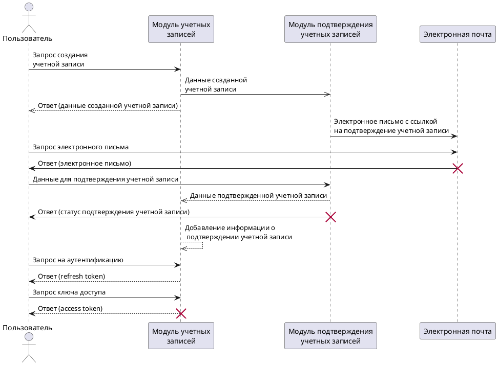

# Auth service

Service sequence diagram:

[](https://editor.plantuml.com/uml/dLJBJi905DtFLqnOoQ8_uABXGzXCoXY9MaWV2tSyL1OeR4pS6Fq2aufK2zZo2tV-o3DJC51BIGn9oJ3td7lkEPSs_41uGNXroOGJT3nEhvJHIjtJ5xvd5Aa1nVhCXSz3raLjssbtXHlm6ZsZPAw6vbeDrOXYLATgh6wRBl0HhIbHVU0NDGqN5N2KwiC0BMFLeq-Q0vO2Fcsw-zIyX5aw1UetMk5ogGRWoi2JOf2fQQ9688fo56EXPOjJJa-QKPUgFWTjXXPp_6Jwyrq1k5hi2aYOi6nREk1uD018f7YV8mSTOm5D29QNZGK3VhA57sAiuAipwLYs1DzV8pAmvNK8-PioRcR6PupIvKQhDknW9bfEnInXtddFquSI6H_elICaOj8gMb2AsvTVPotf1rxd6d7gpiKe87grYRvylofdWOq8HXGvoycEnc9IAOxOr_k80OVmwNygTonmyatA1MVqZgAPiJ2F3OzKtI2IdZPStU6SSCgQxk6iayg1olv0-Uv4WEbNHufdWfu9TijqL1EZiM239yyywP_pe7CXtNefxH91JY0bqfbcsZUyEzROcn8wuJZIzxTil_u8nXhIRUcttGy0)

[PlantUML Editor](https://editor.plantuml.com/uml/dLJBJi905DtFLqnOoQ8_uABXGzXCoXY9MaWV2tSyL1OeR4pS6Fq2aufK2zZo2tV-o3DJC51BIGn9oJ3td7lkEPSs_41uGNXroOGJT3nEhvJHIjtJ5xvd5Aa1nVhCXSz3raLjssbtXHlm6ZsZPAw6vbeDrOXYLATgh6wRBl0HhIbHVU0NDGqN5N2KwiC0BMFLeq-Q0vO2Fcsw-zIyX5aw1UetMk5ogGRWoi2JOf2fQQ9688fo56EXPOjJJa-QKPUgFWTjXXPp_6Jwyrq1k5hi2aYOi6nREk1uD018f7YV8mSTOm5D29QNZGK3VhA57sAiuAipwLYs1DzV8pAmvNK8-PioRcR6PupIvKQhDknW9bfEnInXtddFquSI6H_elICaOj8gMb2AsvTVPotf1rxd6d7gpiKe87grYRvylofdWOq8HXGvoycEnc9IAOxOr_k80OVmwNygTonmyatA1MVqZgAPiJ2F3OzKtI2IdZPStU6SSCgQxk6iayg1olv0-Uv4WEbNHufdWfu9TijqL1EZiM239yyywP_pe7CXtNefxH91JY0bqfbcsZUyEzROcn8wuJZIzxTil_u8nXhIRUcttGy0)

