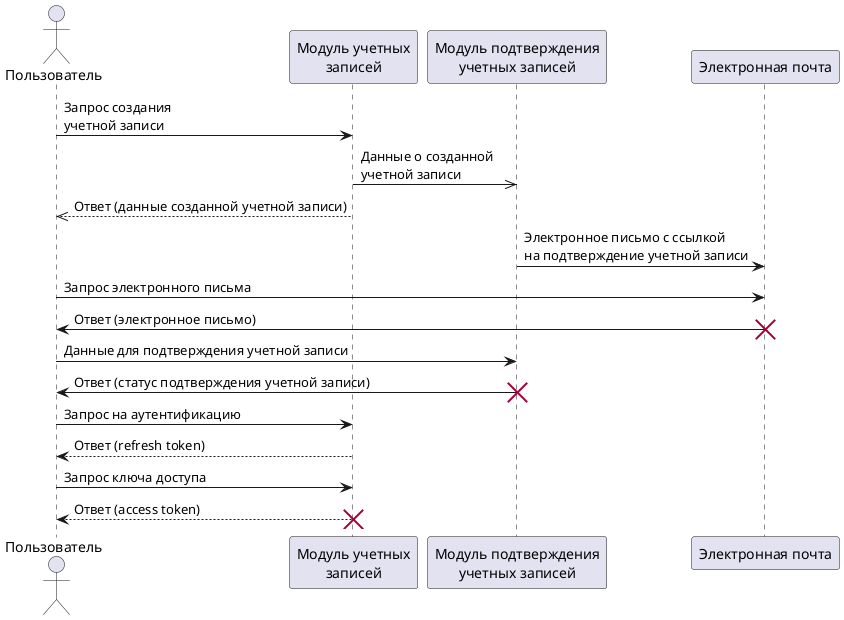

# Auth service

Service sequence diagram:

[](https://editor.plantuml.com/uml/dPHFJi906CNtSue9Ardq0YuQ3i9cCeoHg8NqpyAT59K52XiJDqPFOD9egr1ikSBCZNmp1TEMMXC30Thvtkzxy-OhFSzdhXzSd1F6_P5BvOlCvKRToKzylyb8XJBHrvHvD21Zr0xvSCmSdtRa4qfYDJNBQgfcCa5rfkRgfkz07ycjNAa9zEkEbhCMEKhrHOYMYRgI7pA6B8DysNUgQDf05ho6VfKRBAOg12i79yD6bgQ9cW4K5If20ijcnrG-Qg8kLHCAR8uMCMwP_hHi04lhie4LOPPj2mx6Wn70eaoepAkOGlSN2AG0eETT2Y4zsiiDj87OmkiImIrRW7UOHQujcZgSyvSnYpTUSvIcEwywir-FHTjfsKjGTAx4UjzWunszIqOY8gnw18swglqk6GZFTqUNE57T-U0qOepOicN4MlUYOwnxckWPWgCfDlO_RCapRnp38lu82Fq0PlXSgMi4d-BUBNulpC3KZBdYn1NUAVL7PyBfDc9JPB60hKZ7akkTu0dS8le67EDSUDwUzkEO4T8Jpa3_Ptm3)

[PlantUML Editor](https://editor.plantuml.com/uml/dPHFJi906CNtSue9Ardq0YuQ3i9cCeoHg8NqpyAT59K52XiJDqPFOD9egr1ikSBCZNmp1TEMMXC30Thvtkzxy-OhFSzdhXzSd1F6_P5BvOlCvKRToKzylyb8XJBHrvHvD21Zr0xvSCmSdtRa4qfYDJNBQgfcCa5rfkRgfkz07ycjNAa9zEkEbhCMEKhrHOYMYRgI7pA6B8DysNUgQDf05ho6VfKRBAOg12i79yD6bgQ9cW4K5If20ijcnrG-Qg8kLHCAR8uMCMwP_hHi04lhie4LOPPj2mx6Wn70eaoepAkOGlSN2AG0eETT2Y4zsiiDj87OmkiImIrRW7UOHQujcZgSyvSnYpTUSvIcEwywir-FHTjfsKjGTAx4UjzWunszIqOY8gnw18swglqk6GZFTqUNE57T-U0qOepOicN4MlUYOwnxckWPWgCfDlO_RCapRnp38lu82Fq0PlXSgMi4d-BUBNulpC3KZBdYn1NUAVL7PyBfDc9JPB60hKZ7akkTu0dS8le67EDSUDwUzkEO4T8Jpa3_Ptm3)

