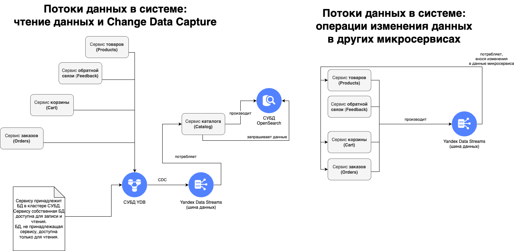

# Data architecture

System is implemented in microservices architecture and leverages EDA (Event-Driven Architecture).

Event-Driven architecture allows for data decoupling in distributed system and it increases service's capability for scaling because most of the writes to the database are performed in batch manner (messages are batched by the Serverless Trigger before being sent to the processing endpoint), thus writes are performed in bulks, allowing for the increased throughput.

## System Data Streams diagram

Диаграмма не совсем актуальна. Сервис `SERVICE_A` читает только таблицы, принадлежащие этому сервису, но не читает таблицы, принадлежащие другим сервисам.

Взаимодействие между сервисами при необходимости чтения сервисом `A` данных сервиса `B` происходит через публикацию сообщения *Publish Data Request*, которое обрабатывает сервис `B`, публикуя нужные сервису `A` данные.

Асинхронный способ взаимодействия характерен как для операций на чтение данных, так и для операций на запись данных.

