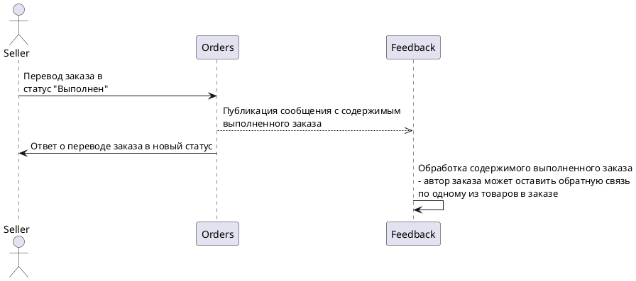

# Feedback

## Technical Details & Limitations

### Permission to add / edit product feedback.

Once order is completed, Orders service publishes an according message with the order id, buyer's (customer's) id. Feedback service processes this message, creating a record of this user purchasing a certain product (and creating last_purchased timestamp field that might be used in the future to create artificial temporal limitations on when user can leave a feedback on the purchased product).

## Architectural Diagrams

### Grant permission to leave feedback

[PlantUML Editor](https://editor.plantuml.com/uml/ZP91Ji9G48RtxnIJxdi15mqhjoxSigbG4YAsfBJxGXCI8v54ztW5U590XSSLPgxWIVodO0AuCKtJbvb__l-RbpO6MPXc-KFFXAqiIUaswlMYbC81vQQFJhVLxOTnHjvDsexIWQUTvBnp7KNjkx1rN_SwnkH-a5mHlt4b1LTisV6IUCrp_iIBBx5jnZAK4Szb9AKCoUCNUU8zb5-ymypECudl1q57VQJa1UeR7PSnRsHACeJKyK8ULNmi7QhBEdO5-HQMssRCzjmQZ-DtTcT8Y0joXCq0PU4m8XNiJrVWwd89ggtK_eDErp4TloQV0R20Ui4EJSpz8Vmb-GzYC_ukNWbd2pCdnGMDUgsEv0SOO6y0DA7wfWgbuntudXN3ofJNCi7rx3L7gJHqAoK1R4sQ0OCvvfnkQa_ZAcCQKTp6N_C3)

