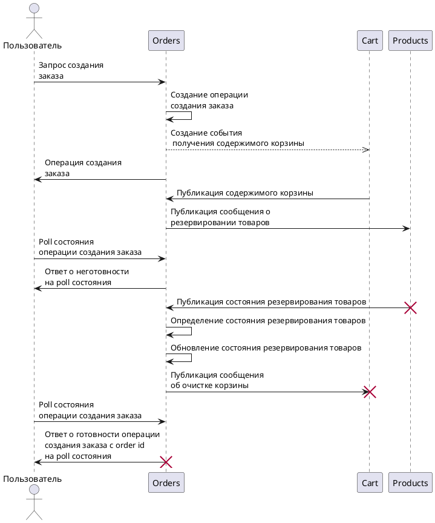

# Order service

Request that spans across many services:

[PlantUML Editor](https://editor.plantuml.com/uml/lLGxRi904ErzYXKz5qY1a7A0S02QbRq54h6HFqKwFbAYY4YKwK2vWKrmR44mLvYzKTwk3R4T0aI9KbZMpEnxRsVcsMtFvwuVtFODRlgEosX16Mta4oLuBocKOufLpBZ70cE0ipspD-2spnethYLShw4gl5gvHg3pmgmMEgvZ1QQVWuHX1CqMlsBqJ27jv90oEM9o1E64LaXjAPKprhKHXhJ6WxV1SyXB-HJ53E6EOd24yXw95B0lJ3MUPgibp2DK6XV9ALe7gcipCAkPJEG3Pf5JwJChBVW6q3kYLyeOs3Ea4gIsSghk6a1WNhxQ7bowMAr3OUOjBkI48jg0Qrs5Ng8hJX6ezXuFlG2FOGqH9vfuYUmmtxwUICemYTmCEbrihUFq-vfEZbHTpZxtLT_5kKtaKmBB4h2nkX3EnQgpGdbRgAYr8WZPuBYu8KwFhdRLxvjMnMhJbl1yrxc3Qmi7phLbOxKDACKby_n2vS0TgPvH-4jcxVOBJQ6t664LC7sgPTVgAwlwx30JyryySSmFF_tkeSiSzUDYFUkScVRjSSDe2zl2J_83)

