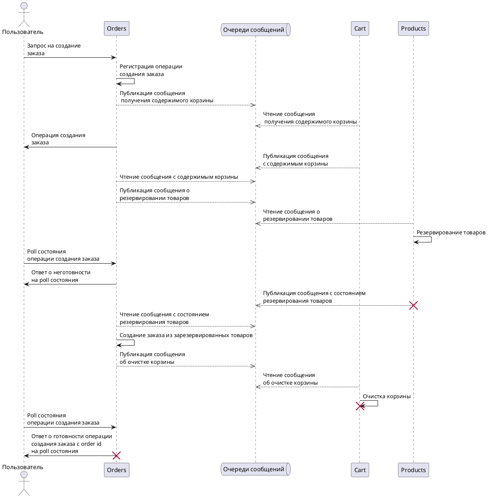
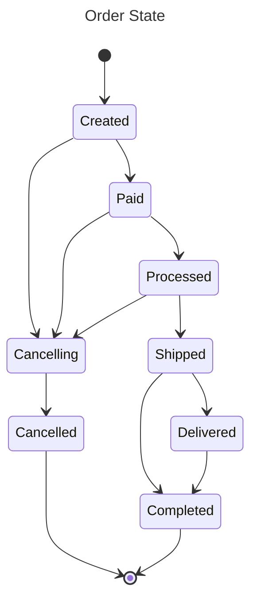
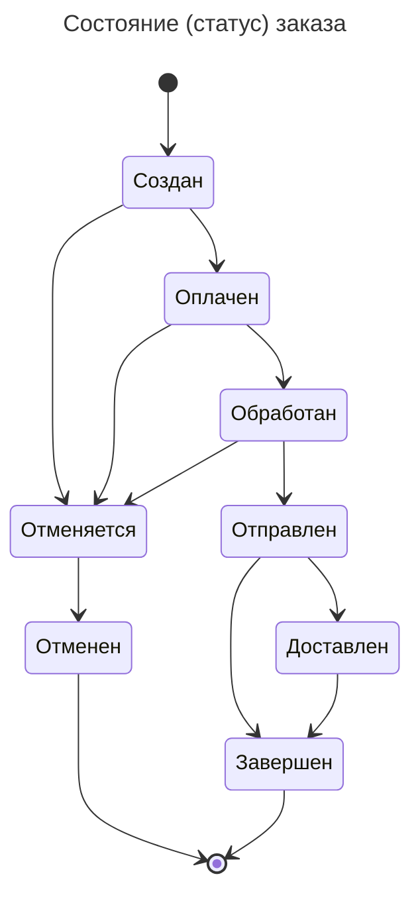
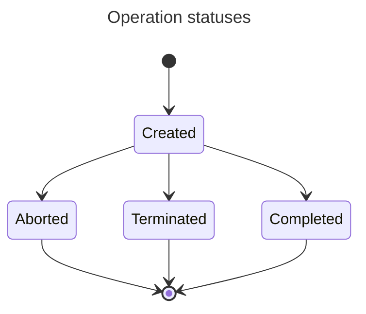
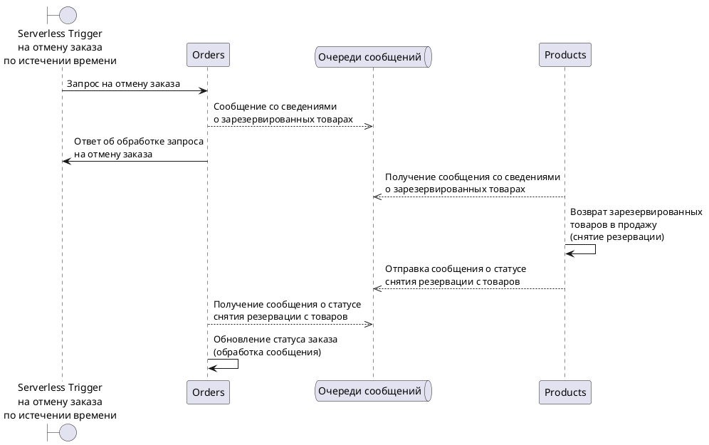
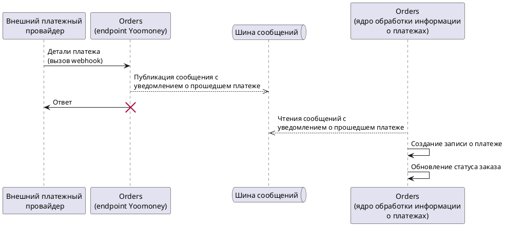

# Order service architecture

## Architecture diagrams

### Order multi-service request processing sequence diagram

Request that spans across many services:

[PlantUML Editor](https://editor.plantuml.com/uml/lLKxJiD04Ett5AlqN832Gk80S80qbhr5f60dZbtGaI102AIKT7mgMXCm3f2OAypUYBTZvsCdW0E88fyTpxmt-_RjUASNsa4O7RI5xOH-8Ec6CdhJbvJYTqIn7b1YrjBkoKXqaDjoMXtR2sLZBt1Lq6kO9xReHYfIia7N-emIVOIY9nfBtGTAHW_w784fZUc5qxjbe5qiEAwSyeFzm7SZ9ymvb13HbcLlIxgYcDx1aUc-16gSqwHWZ9aaaKqFovXUyS6liFEwMpJnI6FTrmDKn_eK_uSIfU_SCWVGTDChuvcSCjgMPNM1TwEFwO7UKFGwHwlkM0-RdWI14VNOQ5CWSjuJypu3O8BL8sKII1b2AK9JVI6KC-EwvuF8T_Ut710d0i7riWgpuYKDAf8kEgkd0gkwqf6-eCbgFxMsB3U5gzad14Ahni0f0uyGFShl0lS2Km-Agy5XeMhs-mDWInMkNL-HL2lo-x7ljzlSW34wleVp4rYn-dT6pvq1b17A1cOBo3ENA2kOfmMBkJLy5JlhoHSgrJo6udINKV1iyfM2fggiXwjwOU0VOdHiQAhVqHRZvguob9QrbOYa7FaK6ERL9wlG6yuUiyQvOIhmt4DsylCXKm_CKWwxPf4LLxCM9-FyYsdN6NRJkM-yuPjNdcovtxbzjZrRY1tbkNYzVW00)

### Order State Diagram

Russian:

### Operation state diagram

### Serverless Trigger Canceling an order after a timeout

[PlantUML Editor](https://editor.plantuml.com/uml/jLJDJi904BxtAIQSyC0BU6Xu0qtqo0MXCIJQbcrhuaqaQ8m74Y_UCBv19LOGRNc5cJVosm7bDtZHjDrDTsQ_dzbfgr5SDt5oVkQS18dVh9jBAXrvvi8pPruKqR5fdPvwfkPppYbn8TVyoHddqYKUSSeJF9WHdt91F9OECZAvjJayvZ7nKAxmyZbRA54zehWHE258MurMMFTZAXsOfcSYZGLEE_4IZqeyi22wznKmqk42rulSpP7VDRsz2dHeWcRIY6TGeUE0gU86-yIFa3a5M24Tskt42IeLrsrZp_CQOwOYx31KKRegVQ2CORzG5DKxKjr31468EKLYBlVI8t3g0WAfz43bGY6e1WW0LAx9CkfWK_X5PKv0hHBd3hJSkqs4toQUWFKXtPy3oQYnQalwVsuBx6u8xWUiZlJyK-liTvoQluI4cUojfg4hvJVfrlmoXERIHwAUo39WAZUsvVOMxcrTfrh9eItDHXV1l5f76YIYJ1tE8EA7mHPd2mDsqAhIHTTi5lm_IRMv1-YJN0CVIwHByEdQjrhUQB1jfTbpdAhdD-sluGi0)

### External Payments Provider triggering state change of an order

[PlantUML Editor](https://editor.plantuml.com/uml/hL8zJiCm5Dvz2giJ7Ne1XgWtO4RAKgWbAgYT9gbGjj020Z5KGin5J32wKKDJcgHNUBuHdrseA3yRYoq_Vt_lsUqexeJni7_60kozurxGaJ5lq3rLb9iRh0KjEQrfHTgCAATNgimTBNs9eacffemqBMaETDhWdOW7kqe7OLU4aI_tXEm6geVIeL9z9KNIT72LiC5G30KyN-1LaURc0h8rpSmj_5m0Xnpy8MmcDBT9kEEaY3EZ6bdVgE1MqLpYc5A91gvnBdnfiLyxqkRg8mnZGSjJoJwd1pGqWjRAgko0OKaPPh2mpVDpSNIYr6cJgQJLyhm1g8zcZ0WW8eBpD9CVFRcIBu7CK9ZZgWHZqsvE9NSHRLTu0zoxjTmDabjBBu3X59NCvcLT4SMXIknKrMUSPuUlVes1j_s761WPV9x0Na13RzWS1mra0S-2Vn_vbZN5g2htZRQ-Y6H7RqPc3AxU266KTcUiZO-4__eE)

