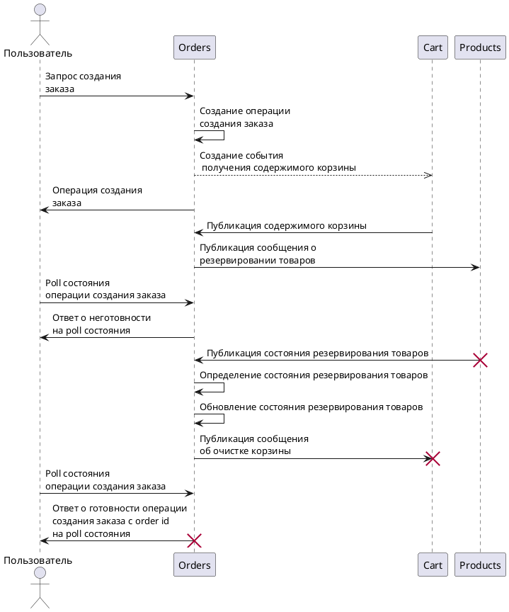
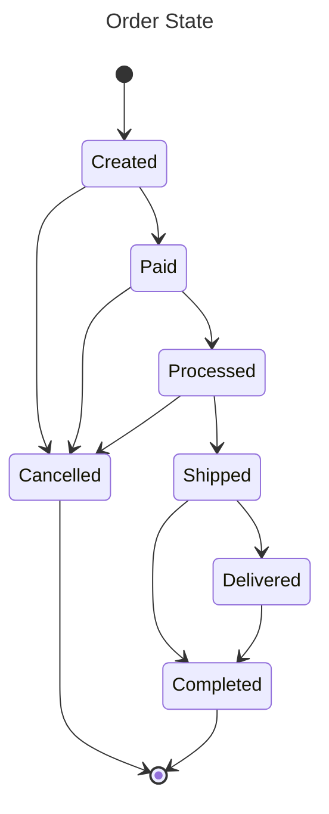
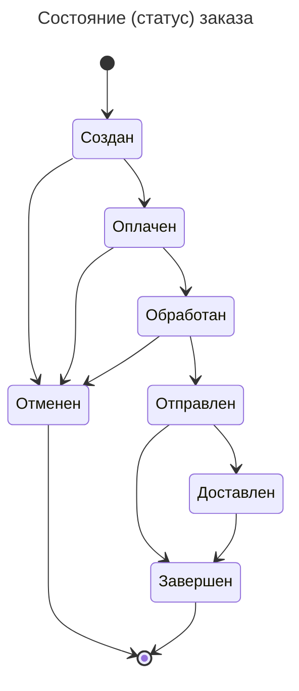
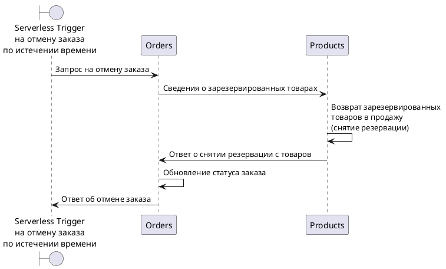
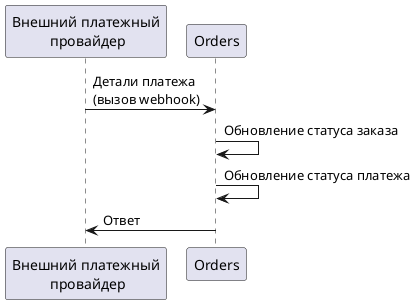

# Order service

## Architecture diagrams

### Order multi-service request processing sequence diagram

Request that spans across many services:

[PlantUML Editor](https://editor.plantuml.com/uml/lLGxRi904ErzYXKz5qY1a7A0S02QbRq54h6HFqKwFbAYY4YKwK2vWKrmR44mLvYzKTwk3R4T0aI9KbZMpEnxRsVcsMtFvwuVtFODRlgEosX16Mta4oLuBocKOufLpBZ70cE0ipspD-2spnethYLShw4gl5gvHg3pmgmMEgvZ1QQVWuHX1CqMlsBqJ27jv90oEM9o1E64LaXjAPKprhKHXhJ6WxV1SyXB-HJ53E6EOd24yXw95B0lJ3MUPgibp2DK6XV9ALe7gcipCAkPJEG3Pf5JwJChBVW6q3kYLyeOs3Ea4gIsSghk6a1WNhxQ7bowMAr3OUOjBkI48jg0Qrs5Ng8hJX6ezXuFlG2FOGqH9vfuYUmmtxwUICemYTmCEbrihUFq-vfEZbHTpZxtLT_5kKtaKmBB4h2nkX3EnQgpGdbRgAYr8WZPuBYu8KwFhdRLxvjMnMhJbl1yrxc3Qmi7phLbOxKDACKby_n2vS0TgPvH-4jcxVOBJQ6t664LC7sgPTVgAwlwx30JyryySSmFF_tkeSiSzUDYFUkScVRjSSDe2zl2J_83)

### Order State Diagram

Russian:

### External Payments Provider triggering state change of an order

[PlantUML Editor](https://editor.plantuml.com/uml/ZL8xJiD04Ett5ADKK7012fGRW0Hb6cEl8ajXRQqT9Bfy52We8j7GHU86cmWJ2nBd2ZCtugsT8Wu88TaQUTwRDszctCtomER3ku6wJOOc2km3TQwrlTTseBECRcpSxslRCxnbHrp9X3TSy5Qcn6js_8aN4VYEA-9Inc0KykGvN799l98HFZPDeaD1HdcOg1HDup1E0vDJvz96scOrTeHSsIGQXdc3fKgXzEmYEIT-HTyTb2iPqz_M52fILBpn2kXxuqFcvEq2hjsjONa4lFIAY0wShJpBZ21Q9m0ucQcqqNf1SbrFvcJo7vcUEH129F_K_k78yOTCU-P4nc3FGIove9QWaqU_p5FVtq-_00dJ-DuL7PILlvQ1GUtsQh_51IzXqGDV-uEXiRyWnf8fXDsFLU82HmPuUR1y2BGgL5URoFzTtm00)

### Serverless Trigger Canceling an order after a timeout

[PlantUML Editor](https://editor.plantuml.com/uml/bP0n3e9044NxFSN6IWilO66uWHUWGI6HgEm6CBQ0ZOcTiVOCAn452Ng5FpToLYjAYzb9Pl_xypDEadfnkjsiXUOUBaBjHQaSu8GE5HtuhT58lD72K84ATtHqHED6FAGCBvGmQ71ZTJQGNY9rtsaM-q6SV7-K47eyLHE9CwiBvbhKVM_ZHaEKlE1XdUKkc2-LMes4-d4NN3cHtTcot6Qh9ENMYWhQKmuZcJHuSd7_1-kbiA2s80zAcrK89uXyUwOF)

