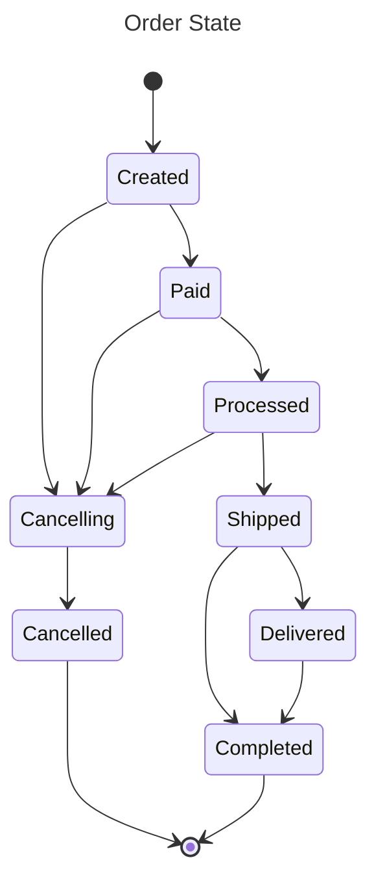
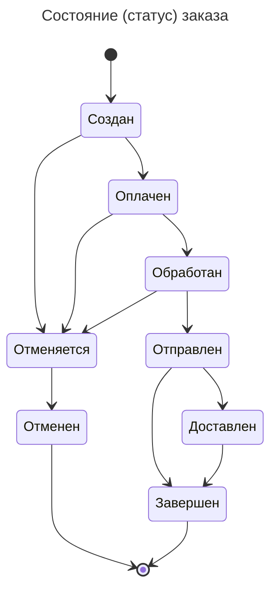
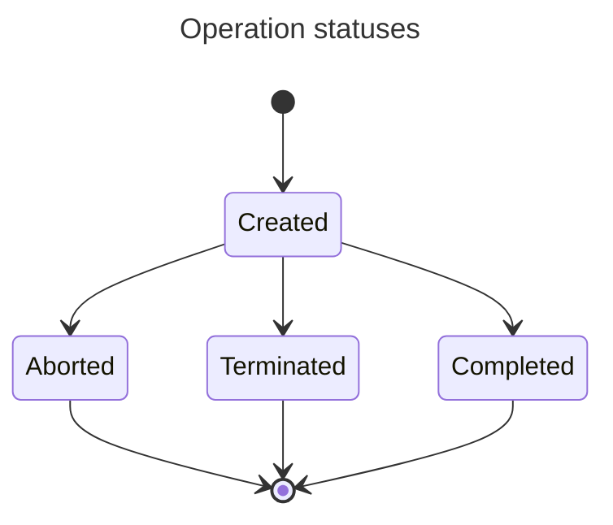
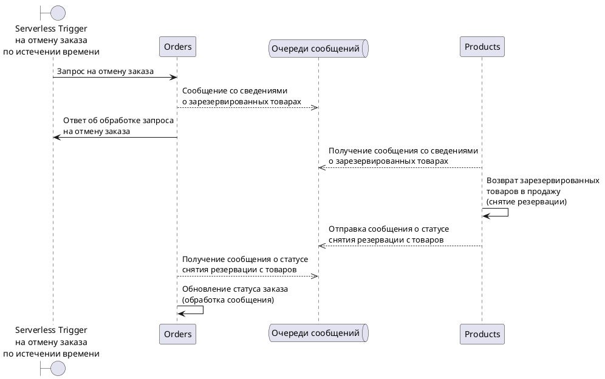
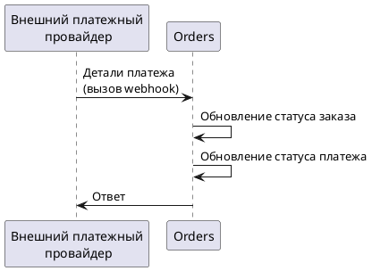

# Order service architecture

## Architecture diagrams

### Order multi-service request processing sequence diagram

Request that spans across many services:

[PlantUML Editor](https://editor.plantuml.com/uml/lLKxJiD04Ett52lwN832Gk80S80qbhr5f607noxeI10W159AkW0LhGaO1qZC5MPlnDknyx4Jm054aTWxE_FUxEoRyKutj8CmEcWBsmdzGD8DPVIchoZ5SqInxbDYrjBkoaXquDjoMXtR2-NMNk2geBjbTkpo3WtrEINw6A5FD9Qw1woC7lG535CQqmi77PQ3Th5WktBA6_k1xqPEc3Cf8QA6PMzBkgQOti6HwPu4QfpJf62CcIIHJG_Bc5xnmrFOUTmjadYaiUxfFg9ZVORtWKJeEwVC1YJTzCfungUCrh2iG-3Tw1Dwe3S4lSxHgYVMWwOdGM1AUs9gKo2otnFpFWDWWjKZPH986KmfJ5DzAPGpuxhdwyXFzxSSA4u4Wk5o5MR1IpMeb7IHMRqgS5LNCjAND5dDfzQHvQPmDVD4WP2g4N3Am2DOZ_EEu5mWwdxH86mMgcQ-Fm2sLA7QzH59DIBlZts_tUO4ZD3nFvZVm8hKlnDwhWoWZ13MDqU0dscYh62U5YocQxWLE-l95rMgUGt5xIwZO6_oLGLDLBaUhkg6WN-4qR6Xg7v7MuoRkyfGMgwjX2LbowV04Ay-NONUSFQODUuDKu7d7hoJdm-PUc2MSbWr2w-uwhMu6UTVHBjEi9lEVQCDttpuPClzJkspuzb2x2ZFnKVs0m00)

### Order State Diagram

Russian:

### Operation state diagram

### Serverless Trigger Canceling an order after a timeout

[PlantUML Editor](https://editor.plantuml.com/uml/jLJDJi904BxtAIQSyC0BU6Xu0qtqo0MXCIJQbcrhuaqaQ8m74Y_UCBv19LOGRNc5cJVosm7bDtZHjDrDTsQ_dzbfgr5SDt5oVkQS18dVh9jBAXrvvi8pPruKqR5fdPvwfkPppYbn8TVyoHddqYKUSSeJF9WHdt91F9OECZAvjJayvZ7nKAxmyZbRA54zehWHE258MurMMFTZAXsOfcSYZGLEE_4IZqeyi22wznKmqk42rulSpP7VDRsz2dHeWcRIY6TGeUE0gU86-yIFa3a5M24Tskt42IeLrsrZp_CQOwOYx31KKRegVQ2CORzG5DKxKjr31468EKLYBlVI8t3g0WAfz43bGY6e1WW0LAx9CkfWK_X5PKv0hHBd3hJSkqs4toQUWFKXtPy3oQYnQalwVsuBx6u8xWUiZlJyK-liTvoQluI4cUojfg4hvJVfrlmoXERIHwAUo39WAZUsvVOMxcrTfrh9eItDHXV1l5f76YIYJ1tE8EA7mHPd2mDsqAhIHTTi5lm_IRMv1-YJN0CVIwHByEdQjrhUQB1jfTbpdAhdD-sluGi0)

### External Payments Provider triggering state change of an order

[PlantUML Editor](https://editor.plantuml.com/uml/bP0n3e9044NxFSN6IWilO66uWHUWGI6HgEm6CBQ0ZOcTiVOCAn452Ng5FpToLYjAYzb9Pl_xypDEadfnkjsiXUOUBaBjHQaSu8GE5HtuhT58lD72K84ATtHqHED6FAGCBvGmQ71ZTJQGNY9rtsaM-q6SV7-K47eyLHE9CwiBvbhKVM_ZHaEKlE1XdUKkc2-LMes4-d4NN3cHtTcot6Qh9ENMYWhQKmuZcJHuSd7_1-kbiA2s80zAcrK89uXyUwOF)

