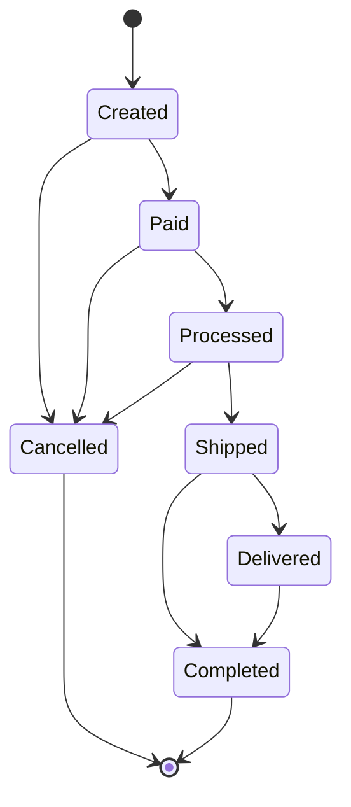

# Order microservice

## Data Model

[DB Diagram](https://dbdiagram.io/d/ecom-67b96d09263d6cf9a01083b2)

YDB Schema:

```sql
CREATE TABLE `orders/orders` (
  user_id String NOT NULL,
  product_id Utf8 NOT NULL,
  count Uint32 NOT NULL,
  -- contents of order
  contents Json NOT NULL,
  -- For ease of desinging and implementing business processes only online payments are allowed
  -- online_payment Bool NOT NULL DEFAULT false,
  PRIMARY KEY (user_id, product_id),
);
```

```sql
CREATE TABLE `orders/payments` (
  id String NOT NULL,
  order_id String NOT NULL,
  provider Json NOT NULL,
  created_at Timestamp NOT NULL,
  updated_at Timestamp NOT NULL,
  refunded_at Timestamp,
  PRIMARY KEY (id),
  INDEX idx_order_id GLOBAL ASYNC on (order_id)
);
```

## General idea

Orders that are older than one hour and are not paid online (if not paid by cash) are cancelled. Order cancellation is scheduled regularly.

## Architecture diagrams

### Order State Diagram



## Run

### Setup env and run
